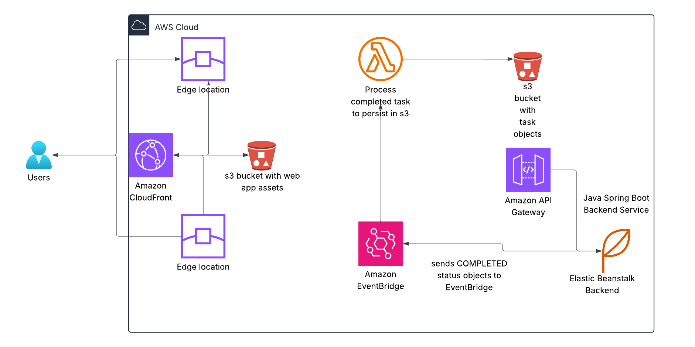

# Cloud-Native Task Manager

A full-stack cloud-native application demonstrating modern software development practices with Spring Boot, Angular, and AWS services.

---

**Live Demo**: [https://d3eohu6f5v8xz9.cloudfront.net/](https://d3eohu6f5v8xz9.cloudfront.net/)

**API Documentation**: [http://cloud-task-manager-env.eba-jrrbb8xa.us-east-1.elasticbeanstalk.com/swagger-ui/index.html#/](http://cloud-task-manager-env.eba-jrrbb8xa.us-east-1.elasticbeanstalk.com/swagger-ui/index.html#/)

## DEMO VIDEO:
[AWS Cloud Full Stack Architecture and Demo](https://drive.google.com/file/d/1nCe-jKmgFN4hT38MI4doDSGIPuFPRXRJ/view?usp=drive_link)
 
[Swagger Demo for Documentation](https://drive.google.com/file/d/1ZJ1Fie5GHxv4gOC5dujcfX-Gl5JInIfc/view?usp=drive_link)


## Cloud Native Project Architecture:



## Architecture Overview

This project consists of three main components:
- **Spring Boot REST API** - Backend service for task management
- **Angular Frontend** - Responsive web application 
- **AWS Lambda Function** - Event-driven serverless task processing

## Project Structure

```
cloud-native-task-manager/
├── springboot-task-api/         # Java Spring Boot backend
├── angular-task-ui/             # Angular frontend application
├── aws-lambda-task-handler/     # Python Lambda function
├── deployment/                  # Deployment configurations
└── README.md                   # Project documentation
```

## Features

### Backend (Spring Boot)
- RESTful API with full CRUD operations
- Input validation and error handling
- Pagination and filtering capabilities
- Swagger/OpenAPI documentation
- Comprehensive unit tests
- CORS configuration for frontend integration

### Frontend (Angular)
- Responsive user interface with Angular Material
- Reactive forms with validation
- Task management CRUD (create, read, update, delete)
- Pagination and status filtering
- Real-time validation feedback
- Success/error message handling

### AWS Lambda
- Event-driven task completion processing
- AWS SDK integration with S3
- Structured logging and error handling
- Simulated cloud-native workflow

## Technologies Used

- **Backend**: Java 17, Spring Boot 3.x, Spring Data JPA, Maven
- **Frontend**: Angular 16+, Angular Material, TypeScript, RxJS
- **Cloud**: AWS Lambda, S3, EC2/Elastic Beanstalk, CloudFront
- **Database**: H2 (development), PostgreSQL (production)
- **Testing**: JUnit 5, Mockito, Jasmine, Karma

## Quick Start


### 1. Spring Boot Backend

```bash
cd springboot-task-api
mvn clean install
mvn spring-boot:run
```

The API will be available at `http://localhost:8080`
- Swagger UI: `http://localhost:8080/swagger-ui.html`
- API Docs: `http://localhost:8080/v3/api-docs`

### 2. Angular Frontend

```bash
cd angular-task-ui
npm install
ng serve
```

The application will be available at `http://localhost:4200`

### 3. AWS Lambda Function

```bash
cd aws-lambda-task-handler
pip install -r requirements.txt
# Deploy using AWS CLI or SAM CLI (see deployment section)
```

## API Endpoints

| Method | Endpoint | Description |
|--------|----------|-------------|
| GET | `/api/tasks` | Get all tasks with pagination |
| GET | `/api/tasks/{id}` | Get task by ID |
| POST | `/api/tasks` | Create new task |
| PUT | `/api/tasks/{id}` | Update existing task |
| DELETE | `/api/tasks/{id}` | Delete task |

### Query Parameters
- `page`: Page number (default: 0)
- `size`: Page size (default: 10)
- `status`: Filter by status (TODO, IN_PROGRESS, COMPLETED)
- `sort`: Sort field and direction (e.g., `dueDate,desc`)

## Testing

### Backend Tests
```bash
cd springboot-task-api
mvn test
```

### Frontend Tests
```bash
cd angular-task-ui
npm test
npm run e2e
```

## Deployment

### AWS Deployment Architecture

1. **Frontend**: Deployed to S3 with CloudFront distribution
2. **Backend**: Deployed to EC2/Elastic Beanstalk with RDS
3. **Lambda**: Event-driven processing with S3 integration

### Deploy Frontend to S3/CloudFront

```bash
cd angular-task-ui
npm run build
aws s3 sync dist/ s3://your-bucket-name
aws cloudfront create-invalidation --distribution-id YOUR_ID --paths "/*"
```

### Deploy Backend to Elastic Beanstalk

```bash
cd springboot-task-api
mvn clean package
eb init
eb create
eb deploy
```

### Deploy Lambda Function

```bash
cd aws-lambda-task-handler
sam build
sam deploy --guided
```

## Configuration

### Environment Variables

#### Spring Boot
```properties
server.port=8080
spring.datasource.url=${DATABASE_URL:jdbc:h2:mem:taskdb}
aws.region=${AWS_REGION:us-east-1}
cors.allowed.origins=${CORS_ORIGINS:http://localhost:4200}
```

#### Angular
```typescript
export const environment = {
  production: true,
  apiUrl: 'https://your-backend-domain.com/api'
};
The apiUrl is my Elastic Beanstalk backend URL that will serve content to front end
```

#### Lambda
```python
import os
S3_BUCKET = os.environ.get('S3_BUCKET', 'task-completion-logs')
AWS_REGION = os.environ.get('AWS_REGION', 'us-east-1')
```

## Performance & Monitoring

- **Backend**: Actuator endpoints for health checks and metrics
- **Frontend**: Angular DevTools and performance budgets
- **Lambda**: CloudWatch logs and X-Ray tracing enabled

## Security Features

- CORS configuration for secure cross-origin requests
- Input validation and sanitization
- AWS IAM roles and policies while following the princple of least privilege
- Environment-based configuration management

## Development Workflow

1. **Local Development**: Use H2 database and mock AWS services
2. **Testing**: Comprehensive unit tests implemented with 88% test coverage for service class
4. **Monitoring**: CloudWatch dashboards and alerts implemented

## Future Enhancements

- User authentication and authorization
- Mobile application with React Native
- Adding a VPC, public and private subnets where I will store the public serving applications in public subnet and the RDS Aurora (it will be better if application is globally scaled) or PostgreSQL database in a private subnet for security.
- I will automate the Infrastrucure using IaC best practises with Terraform, SAM and CloudFormation for all resources.
- I will also add AWS CodeBuild and Pipeline flow for automated CI/CD.
- Microservices architecture with API Gateway


